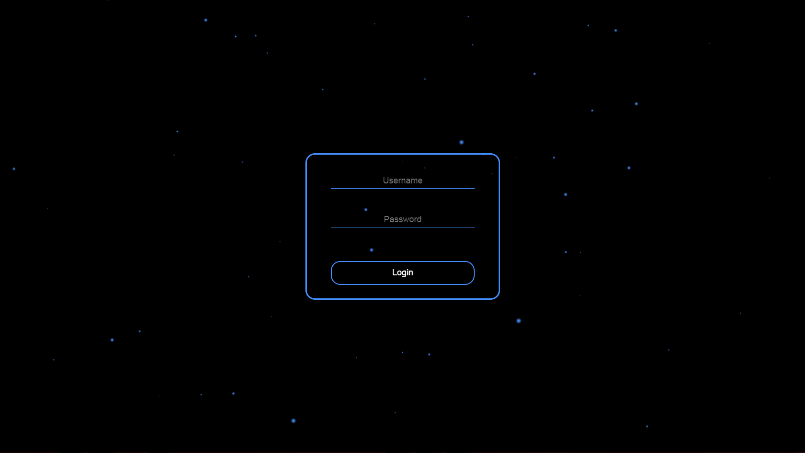
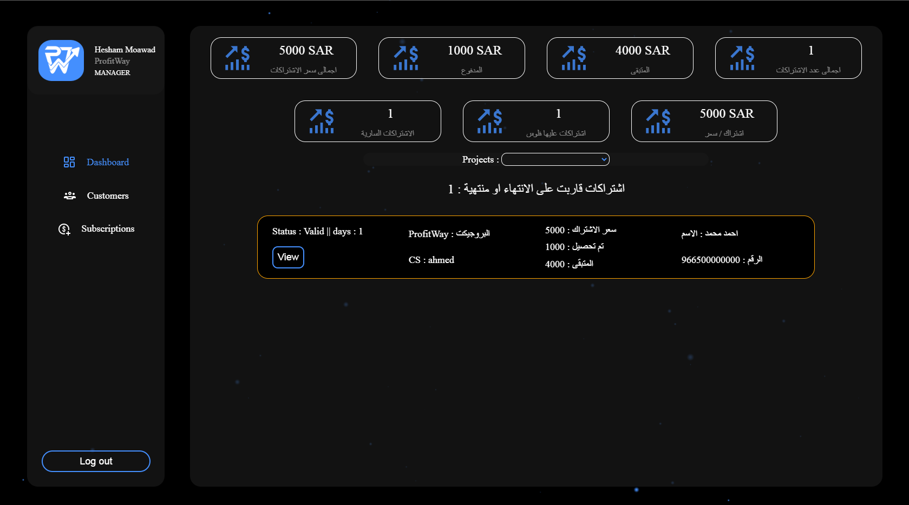
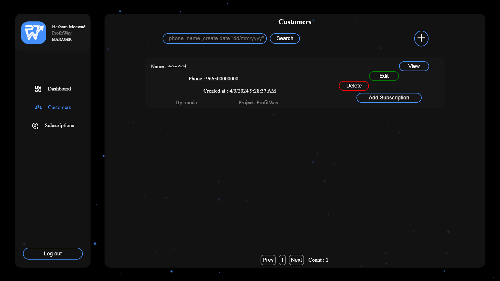
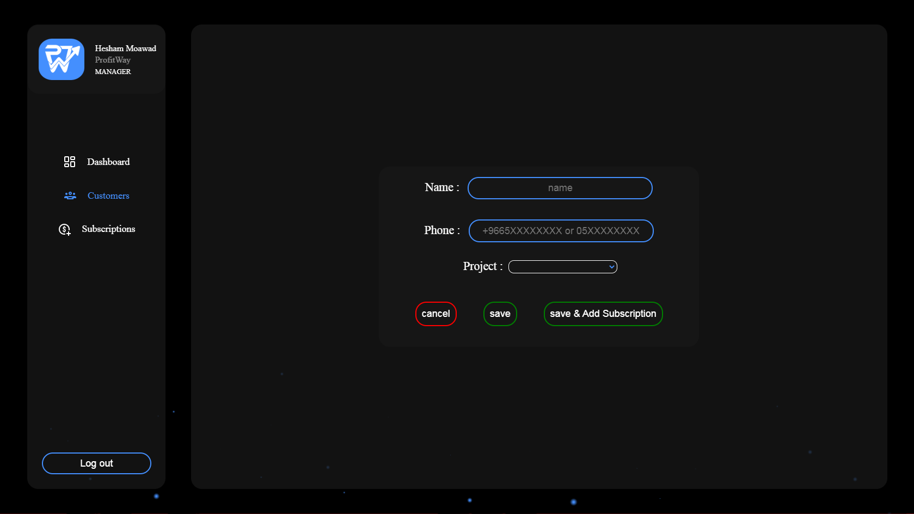
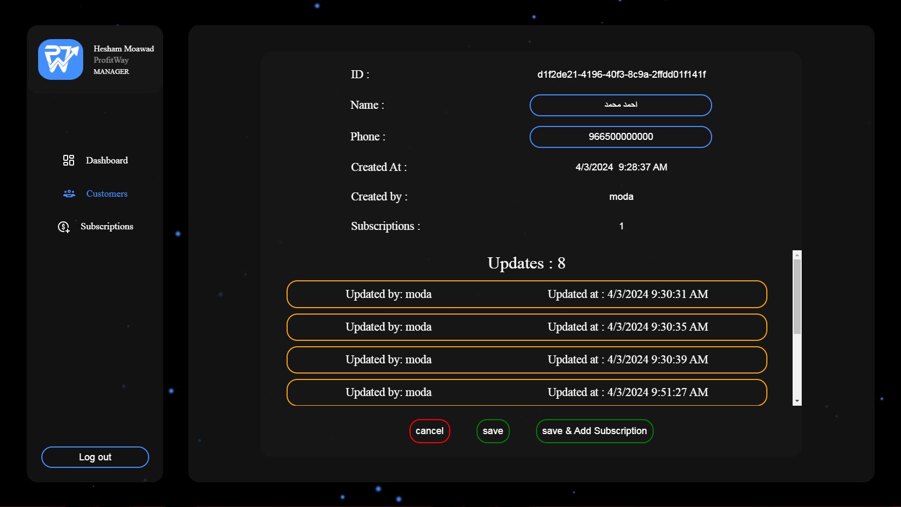
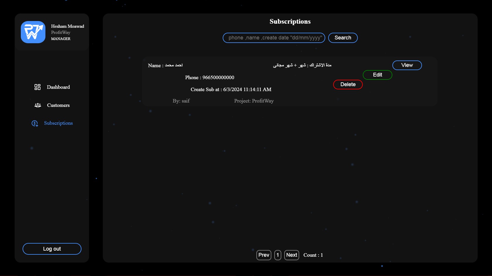
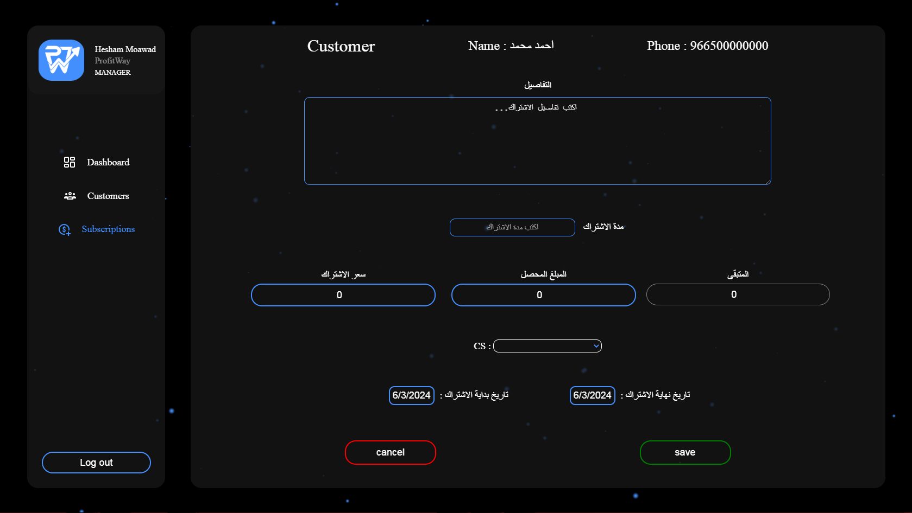
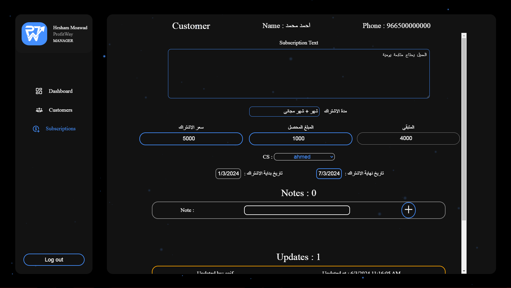

# SalesCRM

## Overview

Sales CRM is a comprehensive customer relationship management system tailored for sales teams. It offers features for managing leads, contacts, subscriptions, and more. The project utilizes modern web technologies for both frontend and backend development.

### Features

- Manage leads, contacts, and deals efficiently.
- Generate reports and analytics to monitor sales performance only in manager User.
- Customizable dashboards for personalized insights.
- Can handle all crud operations and add , update , delete .
    - see [setup](#setup) steps  
    - create super user
        ```bash
        python manage.py createsuperuser
        ```
    - got to /admin and login 
    - Congratulations now you can use site

## Tech Stack

- **Frontend:** React
- **Backend:** Django
- **Authentication:** JSON Web Tokens (JWT)

### ScreenShots

- Login Page : 
    - Handling all logins (without django admin panel)
     

- Dashboard Page:
    - some important analytics (manager only)
    - that contains subscriptions will ended in 7 days 
    - filter category to filter analytics & customers by Project
     

- Customers Pages :
    - that contains all customers from all projects
    - visibility to add , view , edit ,delete (Delete Manager only)
    - main page :
         

    - add page :
        - add customer info (name , phone)
         

    - edit page :
        - edit (name , phone)
        - updates part contain all updates times and user that made
         


- Subscriptions Page :
    - that contains all subscriptions from all projects
    - visibility to add , view , edit ,delete (Delete Manager only)
        

    - add page :
        - page has some validation to save
        

    - edit page :
        - page contain notes & updates part
        

    
- Note View page is look like edit but without editable elements

# Setup

### Prerequisites

Make sure you have the following installed:

- Python
- Django
- DRF
- Node.js **required if you will develop frontend part**
- React **required if you will develop frontend part**
- Other project dependencies (`requirements.txt`)

### Installation

1. Clone the repository:

   ```bash
   git clone "https://github.com/HeshamMoawad/SalesCRM.git"
   ```

2. Install backend dependencies:
    ```bash
    pip install -r backend/requirements.txt
    ```
3. Set up the database:
    ```bash
    python manage.py migrate
    ```
4. Start the Django development server:
    ```bash
    python manage.py runserver
    ```
## Usage

1. Add users Sales , CS , Manager.

2. Add more than project with isolated users and customers (Optional) .

3. Manager user is has all permissions to see all projects info


## Contributors
- [Hesham Moawad](https://github.com/HeshamMoawad)

### License

This project is licensed under the MIT License.

Feel free to contribute and make improvements!